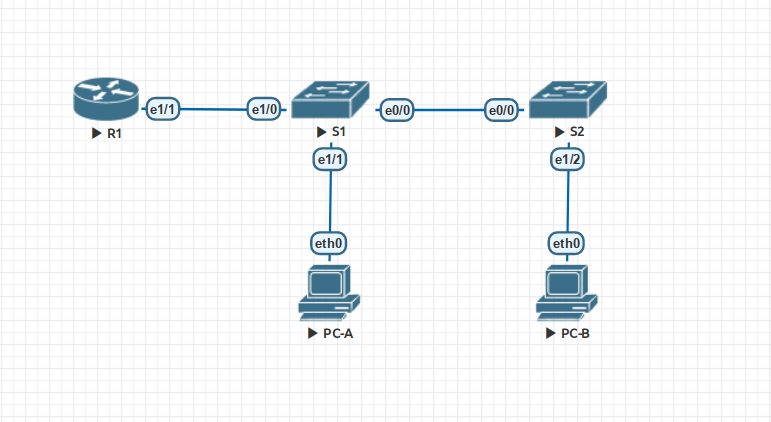
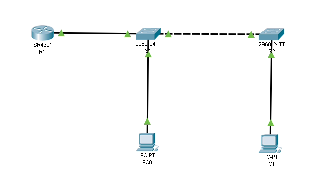

## 2 - VLAN и маршрутизация между VLAN 
## Lab - Configure Router-on-a-Stick Inter-VLAN Routing

### EVE-NG исполенение.

#### Топология сети.


#### Таблица адресов.

| Устройство | Интерфейс | IP адрес | Маска сети | Шлюз |
| --------| --------- | --------- | -------- | ------- |
|  R1 | Ethernet1/1.3 | 192.168.3.1 | 255.255.255.0  | нет |
|  R1 | Ethernet1/1.4 | 192.168.4.1 | 255.255.255.0  | нет |
|  R1 | Ethernet1/1.8 | нет | нет  | нет |
|  S1 | VLAN 3 | 192.168.3.11 | 255.255.255.0  | 192.168.3.1 |
|  S2 | VLAN 3 | 192.168.3.12 | 255.255.255.0  | 192.168.3.1 |
|  PC-A | NIC | 192.168.3.3 | 255.255.255.0  | 192.168.3.1 |
|  PC-B | NIV | 192.168.4.3 | 255.255.255.0  | 192.168.4.1 |


#### Таблица VLAN.

| VLAN | Имя | Интерфейс | 
| --------| --------- | --------- | 
|  3 | Management | S1: VLAN 3, S2: VLAN 3, S1: e1/1 | 
|  4 | Operations | S2: e1/2 | 
|  7 | ParkingLot | остальные | 
|  8 | Native | нет | 

#### Конфигурация устройств.
[Конигурация R1](r1-eve.txt)
[Конигурация S1](s1-eve.txt)
[Конигурация S2](s2-eve.txt)


#### Проверка.


[результат теста](test-exe.txt)

Ping from PC-A to its default gateway.
```
PC-A> ping 192.168.3.1
84 bytes from 192.168.3.1 icmp_seq=1 ttl=255 time=29.392 ms
84 bytes from 192.168.3.1 icmp_seq=2 ttl=255 time=9.070 ms
```
Ping from PC-A to PC-B
```
PC-A> ping 192.168.4.3
84 bytes from 192.168.4.3 icmp_seq=1 ttl=63 time=49.956 ms
84 bytes from 192.168.4.3 icmp_seq=2 ttl=63 time=18.897 ms
```
Ping from PC-A to S2
```
PC-A> ping 192.168.3.12
84 bytes from 192.168.3.12 icmp_seq=1 ttl=255 time=0.556 ms
84 bytes from 192.168.3.12 icmp_seq=2 ttl=255 time=0.580 ms
```
From the command prompt on PC-B, issue the tracert command to the address of PC-A.
```
PC-B> trace 192.168.3.3
trace to 192.168.3.3, 8 hops max, press Ctrl+C to stop
 1   192.168.4.1   15.794 ms  9.784 ms  9.169 ms
 2   *192.168.3.3   19.675 ms (ICMP type:3, code:3, Destination port unreachable)
PC-B> 
```
What intermediate IP addresses are shown in the results?
```
192.168.4.1 
```


### cisco packet tracer исполенение.

#### Топология сети.


#### Таблица адресов.

| Устройство | Интерфейс | IP адрес | Маска сети | Шлюз |
| --------| --------- | --------- | -------- | ------- |
|  R1 | GigabitEthernet0/0/1.3 | 192.168.3.1 | 255.255.255.0  | нет |
|  R1 | GigabitEthernet0/0/1.4 | 192.168.4.1 | 255.255.255.0  | нет |
|  R1 | GigabitEthernet0/0/1.8 | нет | нет  | нет |
|  S1 | VLAN 3 | 192.168.3.11 | 255.255.255.0  | 192.168.3.1 |
|  S2 | VLAN 3 | 192.168.3.12 | 255.255.255.0  | 192.168.3.1 |
|  PC-A | NIC | 192.168.3.3 | 255.255.255.0  | 192.168.3.1 |
|  PC-B | NIC | 192.168.4.3 | 255.255.255.0  | 192.168.4.1 |


#### Таблица VLAN.

 VLAN | Имя | Интерфейс 
 --------| --------- | --------- 
  3 | Management | S1: VLAN 3, S2: VLAN 3, S1: Fa0/10 
  4 | Operations | S2: Fa0/20 
  7 | ParkingLot | остальные 
  8 | Native | нет 

#### Конфигурация устройств.
[Конигурация R1](r1-pt.txt)
[Конигурация S1](s1-pt.txt)
[Конигурация S2](s2-pt.txt)


#### Проверка.


[результат теста](test-pt.txt)

Ping from PC-A to its default gateway.
```
C:\>ping 192.168.3.1 
Pinging 192.168.3.1 with 32 bytes of data:
Reply from 192.168.3.1: bytes=32 time=1ms TTL=255
Reply from 192.168.3.1: bytes=32 time<1ms TTL=255
Ping statistics for 192.168.3.1:
    Packets: Sent = 2, Received = 2, Lost = 0 (0% loss),
Approximate round trip times in milli-seconds:
    Minimum = 0ms, Maximum = 1ms, Average = 0ms
```
Ping from PC-A to PC-B
```
C:\>ping 192.168.4.3 
Pinging 192.168.4.3 with 32 bytes of data:
Reply from 192.168.4.3: bytes=32 time<1ms TTL=127
Reply from 192.168.4.3: bytes=32 time<1ms TTL=127
Reply from 192.168.4.3: bytes=32 time<1ms TTL=127
Ping statistics for 192.168.4.3:
    Packets: Sent = 3, Received = 3, Lost = 0 (0% loss),
Approximate round trip times in milli-seconds:
    Minimum = 0ms, Maximum = 0ms, Average = 0ms
```
Ping from PC-A to S2
```
C:\>ping 192.168.3.12 
Pinging 192.168.3.12 with 32 bytes of data:
Request timed out.
Reply from 192.168.3.12: bytes=32 time<1ms TTL=255
Reply from 192.168.3.12: bytes=32 time<1ms TTL=255
Ping statistics for 192.168.3.12:
    Packets: Sent = 3, Received = 2, Lost = 1 (34% loss),
Approximate round trip times in milli-seconds:
    Minimum = 0ms, Maximum = 0ms, Average = 0ms
```
From the command prompt on PC-B, issue the tracert command to the address of PC-A.
```
C:\>tracert 192.168.3.3
Tracing route to 192.168.3.3 over a maximum of 30 hops: 
  1   0 ms      0 ms      0 ms      192.168.4.1
  2   0 ms      0 ms      0 ms      192.168.3.3
Trace complete.
```
What intermediate IP addresses are shown in the results?
```
192.168.4.1 
```


