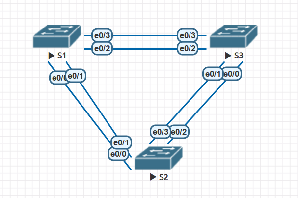
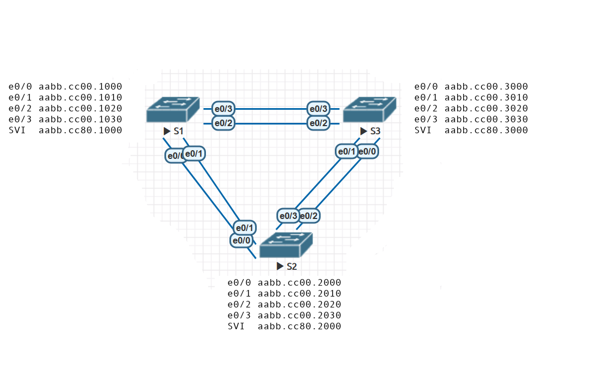

 
## 3 - Избыточность локальных сетей. STP 
## Лабораторная работа. Развертывание коммутируемой сети с резервными каналами

#### Топология сети.



#### Таблица адресов.

| Устройство | Интерфейс | IP адрес | Маска сети | 
| --------| --------- | --------- | -------- | 
|  S1 | VLAN 1 | 192.168.1.1 | 255.255.255.0  | 
|  S2 | VLAN 1 | 192.168.1.2 | 255.255.255.0  | 
|  S3 | VLAN 1 | 192.168.1.3 | 255.255.255.0 | 

#### Конфигурация устройств.
[Конфигурация S1](s1.txt)
[Конфигурация S2](s2.txt)
[Конфигурация S3](s3.txt)

#### Проверка.

###### Часть 1. Создание сети и настройка основных параметров устройства

Проверьте способность компьютеров обмениваться эхо-запросами.  
[Результат CLI](test-ping.txt)  
Успешно ли выполняется эхо-запрос от коммутатора S1 на коммутатор S2?  
ДА
```
S1#ping 192.168.1.2
Type escape sequence to abort.
Sending 5, 100-byte ICMP Echos to 192.168.1.2, timeout is 2 seconds:
!!!!!
Success rate is 100 percent (5/5), round-trip min/avg/max = 1/1/1 ms
```
Успешно ли выполняется эхо-запрос от коммутатора S1 на коммутатор S3?	 
ДА
```
S1#ping 192.168.1.3
Type escape sequence to abort.
Sending 5, 100-byte ICMP Echos to 192.168.1.3, timeout is 2 seconds:
!!!!!
Success rate is 100 percent (5/5), round-trip min/avg/max = 1/1/1 ms
```
Успешно ли выполняется эхо-запрос от коммутатора S2 на коммутатор S3?	 
ДА
```
S2#ping 192.168.1.3
Type escape sequence to abort.
Sending 5, 100-byte ICMP Echos to 192.168.1.3, timeout is 2 seconds:
!!!!!
Success rate is 100 percent (5/5), round-trip min/avg/max = 1/1/1 ms
```


###### Часть 2. Определение корневого моста

Отобразите данные протокола spanning-tree.  
[Результат CLI](stp1.txt)

[MAC](mac.txt)


 
S1
```
  Root ID    Priority    32769
             Address     aabb.cc00.1000
  Bridge ID  Priority    32769  
             Address     aabb.cc00.1000
             
Interface           Role Sts Cost      Prio.Nbr Type
------------------- ---- --- --------- -------- --------------------------------
Et0/1               Desg FWD 100       128.2    Shr 
Et0/3               Desg FWD 100       128.4    Shr 
```

S2
```
  Root ID    Priority    32769
             Address     aabb.cc00.1000
  Bridge ID  Priority    32769  
             Address     aabb.cc00.2000
             
Interface           Role Sts Cost      Prio.Nbr Type
------------------- ---- --- --------- -------- --------------------------------
Et0/1               Root FWD 100       128.2    Shr 
Et0/3               Desg FWD 100       128.4    Shr 
```

S3
```
  Root ID    Priority    32769
             Address     aabb.cc00.1000
  Bridge ID  Priority    32769 
             Address     aabb.cc00.3000
             
Interface           Role Sts Cost      Prio.Nbr Type
------------------- ---- --- --------- -------- --------------------------------
Et0/1               Altn BLK 100       128.2    Shr 
Et0/3               Root FWD 100       128.4    Shr 
```

С учетом выходных данных, поступающих с коммутаторов, ответьте на следующие вопросы.
Какой коммутатор является корневым мостом?  
S1

Почему этот коммутатор был выбран протоколом spanning-tree в качестве корневого моста?  
При сравнение MAC (чего?), наименьший был у  S1. Приоритете у всех был одинаковый. 

Какие порты на коммутаторе являются корневыми портами?  
S1 - нет  
S2 - Et0/1  
S3 - Et0/3  

Какие порты на коммутаторе являются назначенными портами?  
S1 - все  
S2 - Et0/3  
S3 - нет  

Какой порт отображается в качестве альтернативного и в настоящее время заблокирован?  
S1 - нет  
S2 - нет  
S3 - Et0/1  

Почему протокол spanning-tree выбрал этот порт в качестве невыделенного (заблокированного) порта?  
Стоимость до рута одинаковая, переходим к сравниванию приоритетов. S3 имеет BID больше чем у S2, поэтому он блокирует порт со свой стороны.


###### Часть 3. Наблюдение за процессом выбора протоколом STP порта, исходя из стоимости портов

[Результат CLI](stp2.txt)

Определите коммутатор с заблокированным портом.
```
S3#sh spanning-tree | inc Et0
Et0/1               Altn BLK 100       128.2    Shr 
Et0/3               Root FWD 100       128.4    Shr 
```
 Заблокирован порт S3 Et0/1. Изменяем стоимость до рута на 90.
```
S3#sh spanning-tree | inc Et0
Et0/1               Desg BLK 100       128.2    Shr 
Et0/3               Root FWD 90        128.4    Shr 
```

Почему протокол spanning-tree заменяет ранее заблокированный порт на назначенный порт и блокирует порт, который был назначенным портом на другом коммутаторе?  
Стоимость пути S3 -> S2 -> S1 (200) , больше чем путь S2 -> S3 -> S1 (190), теперь S2 Et0/3 блокируется.

###### Часть 4. Наблюдение за процессом выбора протоколом STP порта, исходя из приоритета портов

[Результат CLI](stp3.txt)

S2
```
Interface           Role Sts Cost      Prio.Nbr Type
------------------- ---- --- --------- -------- --------------------------------
Et0/0               Root FWD 100       128.1    Shr 
Et0/1               Altn BLK 100       128.2    Shr 
Et0/2               Desg FWD 100       128.3    Shr 
Et0/3               Desg FWD 100       128.4    Shr 
```

S3
```
Interface           Role Sts Cost      Prio.Nbr Type
------------------- ---- --- --------- -------- --------------------------------
Et0/0               Altn BLK 100       128.1    Shr 
Et0/1               Altn BLK 100       128.2    Shr 
Et0/2               Root FWD 100       128.3    Shr 
Et0/3               Altn BLK 100       128.4    Shr 
```

Какой порт выбран протоколом STP в качестве порта корневого моста на каждом коммутаторе некорневого моста?  
S2 Et0/0  
S3 Et0/2  

Почему протокол STP выбрал эти порты в качестве портов корневого моста на этих коммутаторах?  
Поднятые порты стали рут портами, потому что имеют наименьший номер. При одинаковой стоимости и приоритете.


### Основные команды.

Пример изменения приоритета узла.
```
S2#
S2#configure terminal 
S2(config)#spanning-tree vlan 1 priority 40960
S2(config)#exit
S2#
```
Пример изменения стоимости порта.
```
S2#
S2#configure terminal 
S2(config)#int Ethernet0/1
S2(config-if)#spanning-tree cost 5
S2(config-if)#exit
S2(config)#exit
```
Пример изменения приоритета порта.
```
S2#
S2#configure terminal 
S2(config)#int Ethernet0/0
S2(config-if)#spanning-tree port-priority 64
S2(config-if)#exit
S2(config)#exit
S2#
```
Пример полного вывода команды `show spanning-tree`
```
S2#
S2#show spanning-tree 

VLAN0001
  Spanning tree enabled protocol rstp
  Root ID    Priority    32769
             Address     aabb.cc00.1000
             Cost        5
             Port        2 (Ethernet0/1)
             Hello Time   2 sec  Max Age 20 sec  Forward Delay 15 sec

  Bridge ID  Priority    40961  (priority 40960 sys-id-ext 1)
             Address     aabb.cc00.2000
             Hello Time   2 sec  Max Age 20 sec  Forward Delay 15 sec
             Aging Time  300 sec

Interface           Role Sts Cost      Prio.Nbr Type
------------------- ---- --- --------- -------- --------------------------------
Et0/0               Altn BLK 100        64.1    Shr 
Et0/1               Root FWD 5         128.2    Shr 
Et0/2               Desg FWD 100       128.3    Shr 
Et0/3               Desg FWD 100       128.4    Shr 


S2#
```
