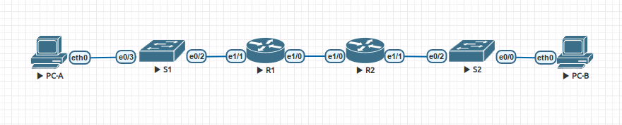

## DHCPv4/v6 и SLAAC 
## Lab - Implement DHCPv4

#### Топология сети.


#### Таблица адресов.

| Устройство | Интерфейс | IP адрес | Маска сети | Шлюз |
| --------| --------- | --------- | -------- | ------- |
|  R1 | Ethernet1/0 | 10.0.0.1 | 255.255.255.252  | нет |
|  R1 | Ethernet1/1 | нет | нет  | нет |
|  R1 | Ethernet1/1.100 | - | -  | нет |
|  R1 | Ethernet1/1.200 | - | -  | нет |
|  R2 | Ethernet1/0 | 10.0.0.2 | 255.255.255.252 | нет |
|  R2 | Ethernet1/1 | - | -  | нет |
|  S1 | VLAN 200 | - | -  | - |
|  S2 | VLAN 1 | - | -  | - |
|  PC-A | NIC | DHCP | DHCP  | DHCP |
|  PC-B | NIC | DHCP | DHCP  | DHCP |


#### Таблица VLAN.

| VLAN | Имя | Интерфейс | 
| --------| --------- | --------- | 
|  1 | - | S2: e0/0 | 
|  100 | Clients | S1: e0/3 | 
|  200 | Management | S1: VLAN 200  | 
|  999 | ParkingLot | S1: e0/0-1 | 
|  1000 | Native | нет | 


#### Конфигурация устройств.
[Конфигурация R1](4-s1.txt)  
[Конфигурация R1](4-s2.txt)  
[Конфигурация R1](4-r1.txt)  
[Конфигурация R1](4-r2.txt)  

##### Часть 1. Стартовая настройка.

Разделение на сети.  
Сеть А: 192.168.1.0/26 Для 58 хостов  Clients  
Сеть Б: 192.168.2.0/27 Для 28 хостов  Management  
Сеть Ц: 192.168.3.0/28 Для 12 хостов  
Если делить одну сеть /24 то можно сделать так:  
Сеть А: 192.168.1.0/26 Для 58 хостов  
Сеть Б: 192.168.1.64/27 Для 28 хостов  
Сеть Ц: 192.168.1.96/28 Для 12 хостов  


Почему интерфейс S2 e0/2 указан в VLAN 1?  
Влан 1 создан и присвоен по умолчанию.

##### Часть 2. Настройка DHCPv4 сервера.

Пример конфигурации пула. (в режиме конфигурации)
```
ip dhcp pool NET-A
 network 192.168.1.0 255.255.255.192
 default-router 192.168.1.1 
 dns-server 192.168.1.1 
 domain-name NET-A
 lease 3
```
Просмотр `show ip dhcp pool `

```
R1#show ip dhcp pool     

Pool NET-A :
 Utilization mark (high/low)    : 100 / 0
 Subnet size (first/next)       : 0 / 0 
 Total addresses                : 62
 Leased addresses               : 1 
 Excluded addresses             : 1
 Pending event                  : none
 1 subnet is currently in the pool :
 Current index        IP address range                    Leased/Excluded/Total
 192.168.1.3          192.168.1.1      - 192.168.1.62      1     / 1     / 62   

Pool NET-C :
 Utilization mark (high/low)    : 100 / 0
 Subnet size (first/next)       : 0 / 0 
 Total addresses                : 14
 Leased addresses               : 1
 Excluded addresses             : 2
 Pending event                  : none
 1 subnet is currently in the pool :
 Current index        IP address range                    Leased/Excluded/Total
 192.168.3.4          192.168.3.1      - 192.168.3.14      1     / 2     / 14   
R1#
```

Просмотр `show ip dhcp bindings `
```
R1#show ip dhcp binding
Bindings from all pools not associated with VRF:
IP address      Client-ID/              Lease expiration        Type       State      Interface
                Hardware address/
                User name
192.168.1.2     0100.5079.6668.05       Jul 23 2020 02:58 PM    Automatic  Active     Ethernet1/1.100
192.168.3.3     0100.5079.6668.06       Jul 23 2020 02:58 PM    Automatic  Active     Unknown
```

Просмотр `show ip dhcp server statistics `

```
R1#show ip dhcp server statistics
Memory usage         17993
Address pools        2
Database agents      0
Automatic bindings   2
Manual bindings      0
Expired bindings     0
Malformed messages   0
Secure arp entries   0
Renew messages       1
Workspace timeouts   0
Static routes        0
Relay bindings       0
Relay bindings active        0
Relay bindings terminated    0
Relay bindings selecting     0

Message              Received
BOOTREQUEST          0
DHCPDISCOVER         4
DHCPREQUEST          2
DHCPDECLINE          0
DHCPRELEASE          0
DHCPINFORM           0
DHCPVENDOR           0
BOOTREPLY            0
DHCPOFFER            0
DHCPACK              0
DHCPNAK              0

Message              Sent
BOOTREPLY            0
DHCPOFFER            2
DHCPACK              2
DHCPNAK              0

Message              Forwarded
BOOTREQUEST          0
DHCPDISCOVER         0
DHCPREQUEST          0
DHCPDECLINE          0
DHCPRELEASE          0
DHCPINFORM           0
DHCPVENDOR           0
BOOTREPLY            0
DHCPOFFER            0
DHCPACK              0
DHCPNAK              0

DHCP-DPM Statistics
Offer notifications sent        0
Offer callbacks received        0
Classname requests sent         0
Classname callbacks received    0

R1#
```

Проверка работы PC-A, пинг шлюза.
```
PC-A> ping 192.168.1.1

84 bytes from 192.168.1.1 icmp_seq=1 ttl=255 time=9.971 ms
84 bytes from 192.168.1.1 icmp_seq=2 ttl=255 time=5.524 ms
```

##### Часть 3. Конфигурация релея.

Пример конфигурации интерфейса с релеем.
```
interface Ethernet1/1
 description to S2
 ip address 192.168.3.1 255.255.255.240
 ip helper-address 10.0.0.1
 duplex full
```

Проверка работы PC-B. Пинг до шлюза сети Clients
```
PC-B> ping 192.168.1.1

84 bytes from 192.168.1.1 icmp_seq=1 ttl=254 time=39.489 ms
84 bytes from 192.168.1.1 icmp_seq=2 ttl=254 time=25.480 ms
```
Прмеры binding  и statistics приведённые выше - актуальны для этого этапа.
