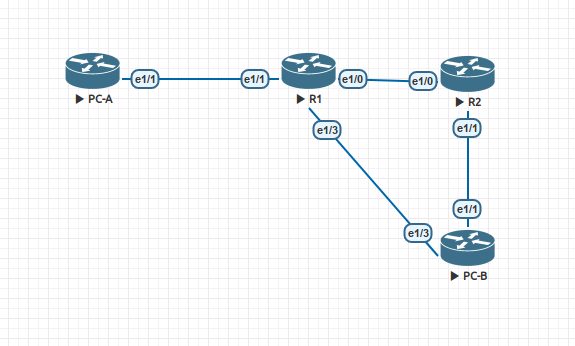

## DHCPv4/v6 и SLAAC 
## Lab - Configure DHCPv6

#### Топология сети.


#### Таблица адресов.

| Устройство | Интерфейс | IP адрес | 
| --------| --------- | --------- | 
|  R1 | Ethernet1/0 | 2001:db8:acad:2::1/64 | 
|  R1 | Ethernet1/1 | 2001:db8:acad:1::1/64 |
|  R2 | Ethernet1/0 | 2001:db8:acad:2::2/64 | 
|  R2 | Ethernet1/1 | 2001:db8:acad:3::1/64 |
|  PC-A | NIC | DHCP | 
|  PC-B | NIC | DHCP | 


#### Таблица VLAN.

| VLAN | Имя | Интерфейс | 
| --------| --------- | --------- | 
|  1 | - | S2: e0/0 | 
|  100 | Clients | S1: e0/3 | 
|  200 | Management | S1: VLAN 200  | 
|  999 | ParkingLot | S1: e0/0-1 | 
|  1000 | Native | нет | 


#### Конфигурация устройств. 
[Конфигурация R1](6-r1.txt)  
[Конфигурация R1](6-r2.txt)  

##### Часть 1. Стартовая настройка.

Проверка связанности. Пинг от шлюзя до шлюза PC.
```
R1#ping 2001:db8:acad:3::1 so 2001:db8:acad:1::1
Type escape sequence to abort.
Sending 5, 100-byte ICMP Echos to 2001:DB8:ACAD:3::1, timeout is 2 seconds:
Packet sent with a source address of 2001:DB8:ACAD:1::1
!!!!!
Success rate is 100 percent (5/5), round-trip min/avg/max = 8/19/40 ms
R1#
```

##### Часть 3. SLAAC адресация.

Простая выдача адресов после команды `ipv6 unicast-routing`
```
PC-A#sh ipv6 int e1/1
Ethernet1/1 is up, line protocol is up
  IPv6 is enabled, link-local address is FE80::C803:7EFF:FED0:1D 
  No Virtual link-local address(es):
  Stateless address autoconfig enabled
  Global unicast address(es):
    2001:DB8:ACAD:1:C803:7EFF:FED0:1D, subnet is 2001:DB8:ACAD:1::/64 [EUI/CAL/PRE]
      valid lifetime 2591976 preferred lifetime 604776
  Joined group address(es):
    FF02::1
    FF02::1:FFD0:1D
  MTU is 1500 bytes
  ICMP error messages limited to one every 100 milliseconds
  ICMP redirects are enabled
  ICMP unreachables are sent
  ND DAD is enabled, number of DAD attempts: 1
  ND reachable time is 30000 milliseconds (using 30000)
  ND NS retransmit interval is 1000 milliseconds
  Default router is FE80::C801:73FF:FE36:1D on Ethernet1/1
PC-A#
PC-A#
PC-A#show ipv6 dhcp int e1/1
PC-A#
```
Настройка пула.
```
ipv6 dhcp pool R1-STATELESS
 dns-server 2001:DB8:ACAD::254
 domain-name STATELESS.com
```
Добавление пула к порту и указания забрать дополнительные сведения.
```
interface Ethernet1/1
 description to PC-A
 no ip address
 duplex full
 ipv6 address 2001:DB8:ACAD:1::1/64
 ipv6 nd other-config-flag
 ipv6 dhcp server R1-STATELESS
 ```
 Теперь PC-A знает больше.
 ```
 PC-A#show ipv6 dhcp int e1/1
Ethernet1/1 is in client mode
  State is IDLE
  List of known servers:
    Reachable via address: FE80::C801:73FF:FE36:1D
    DUID: 00030001CA0173360000
    Preference: 0
    Configuration parameters:
      DNS server: 2001:DB8:ACAD::254
      Domain name: STATELESS.com
  Rapid-Commit: disabled
PC-A#
```
Тесть пинга PC-A до R2
 ```
PC-A#ping 2001:db8:acad:3::1
Type escape sequence to abort.
Sending 5, 100-byte ICMP Echos to 2001:DB8:ACAD:3::1, timeout is 2 seconds:
!!!!!
Success rate is 100 percent (5/5), round-trip min/avg/max = 16/50/136 ms
PC-A#
```
##### Часть 4. Настройка stateful DHCPv6

Создание пула.
```
ipv6 dhcp pool R2-STATEFUL
 address prefix 2001:DB8:ACAD:3:AAA::/80
 dns-server 2001:DB8:ACAD::254
 domain-name STATEFUL.com
```
Привязывание пула к порту
```
interface Ethernet1/0
 description to R2
 no ip address
 duplex full
 ipv6 address FE80::1 link-local
 ipv6 address 2001:DB8:ACAD:2::1/64
 ipv6 nd prefix default 2592000 604800 no-autoconfig
 ipv6 nd managed-config-flag
 ipv6 dhcp server R2-STATEFUL
```
##### Часть 5. Настройка релея.

Пример кофнигурации порта.
```
interface Ethernet1/1
 description to PC-B
 no ip address
 duplex full
 ipv6 address 2001:DB8:ACAD:3::1/64
 ipv6 nd managed-config-flag
 ipv6 dhcp relay destination 2001:DB8:ACAD:2::1 Ethernet1/0
```
С проверкой не получилось, в режиме autoconfig отрабатывает stateless, а включить dhcp клиент - нет команды.
```
PC-B(config-if)#ipv6 address ?
  WORD                General prefix name
  X:X:X:X::X          IPv6 link-local address
  X:X:X:X::X/<0-128>  IPv6 prefix
  autoconfig          Obtain address using autoconfiguration

PC-B(config-if)#ipv6 address 
```


